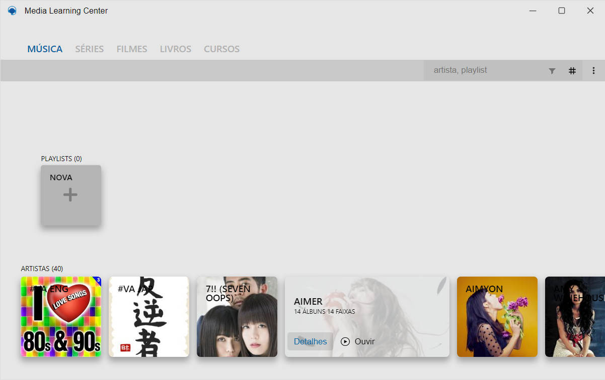
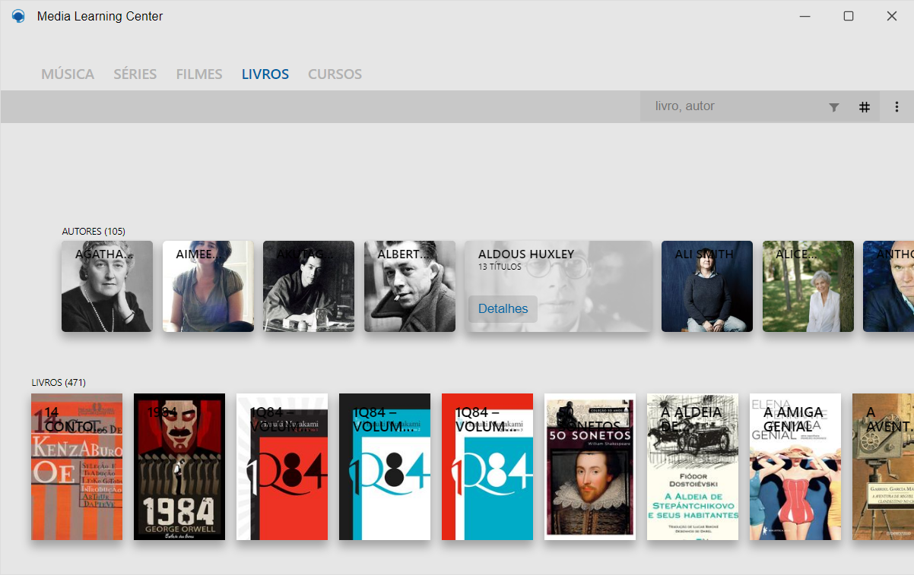
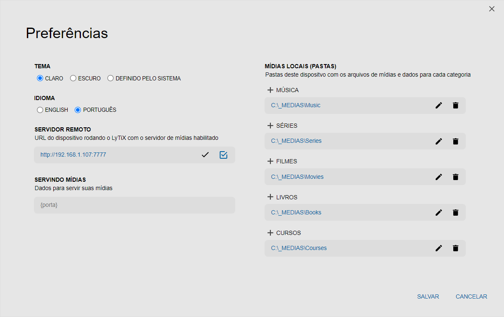
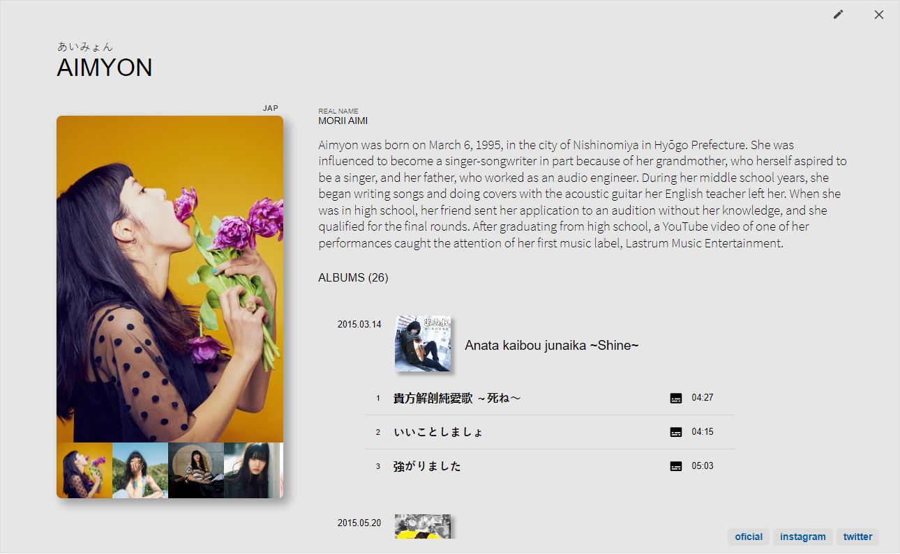
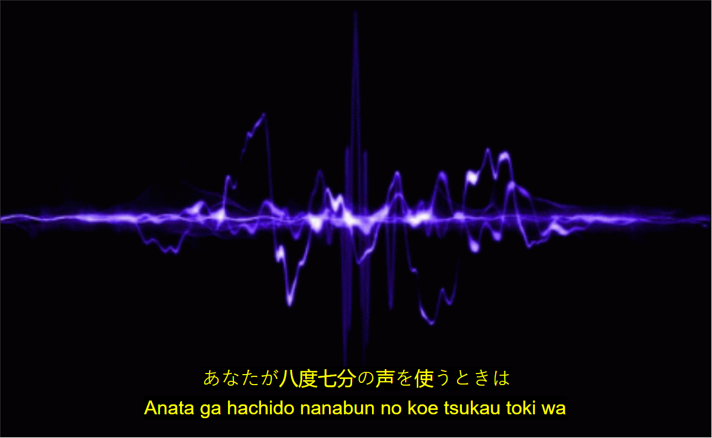
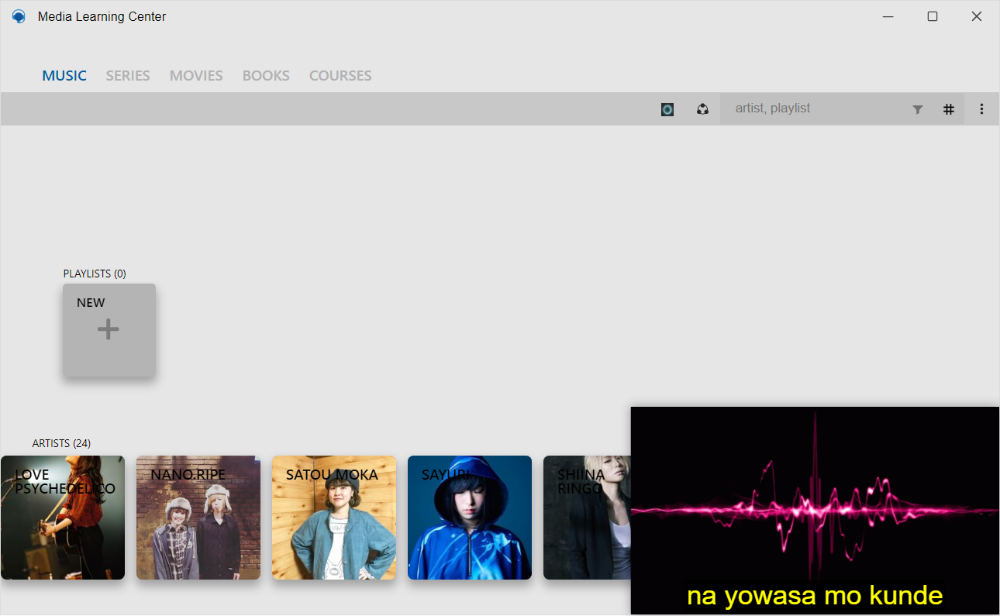

# Media Learning Center

This is a personal project that cames when I started learn Japanese. In addition to the difficulties of the Japanese language, the lack of tools and materials for learning. As I have some media and I wanted to have it available from all my devices without having to copy it, a media server would do the trick. So software capable of reading media metadata (audio, video and ebooks), converting associated texts (subtitles and lyrics), creating a local database accessible through the network would be very useful. I also intend to add the "JMdict" dictionary somehow as I already did in an Android app.

### TAGS `react` `electron` `electron-builder` `node` `worker_threads` `non-blocking` `learn japanese`

# Screenshots

    
    

    
    

    
    

# Complete Windows Software

### More information e Download `Soon as possible`
